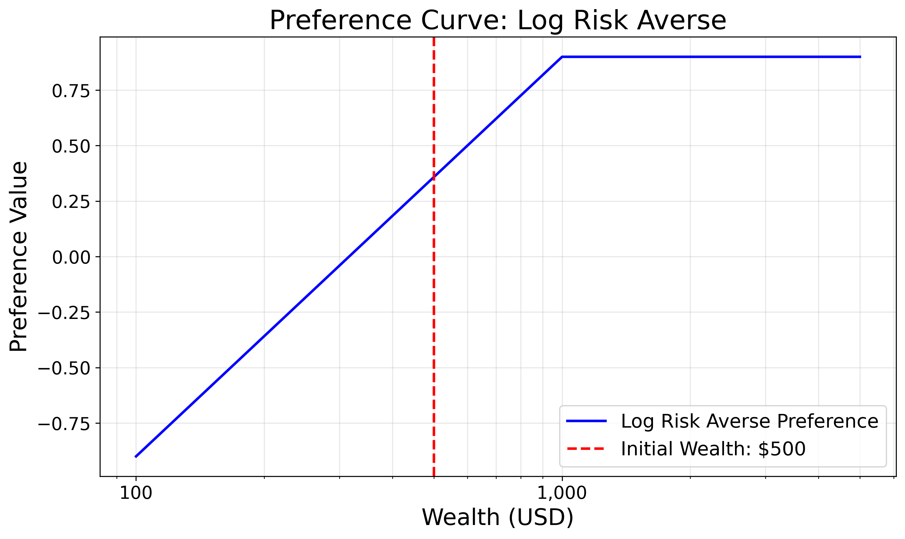
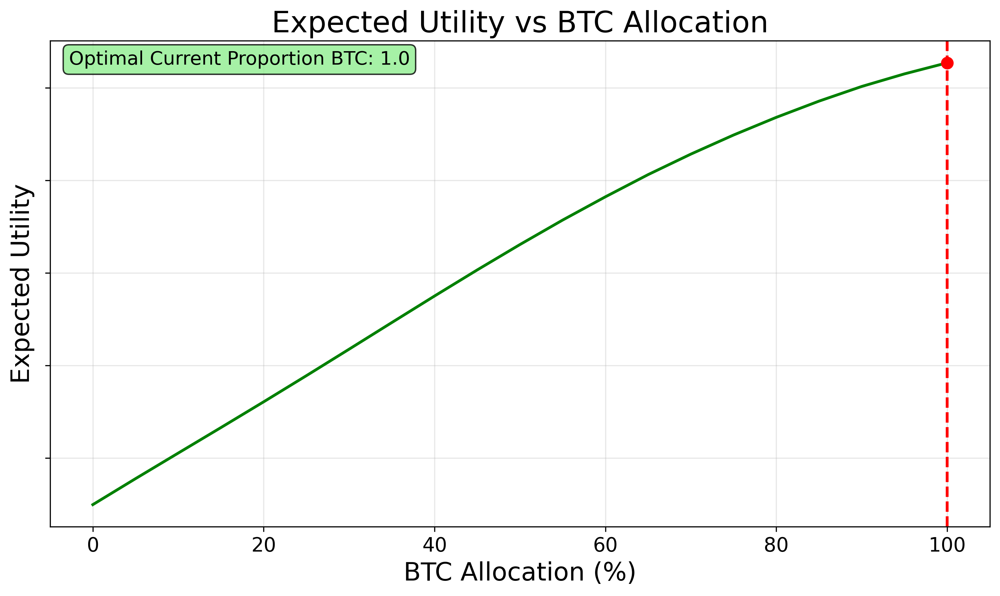
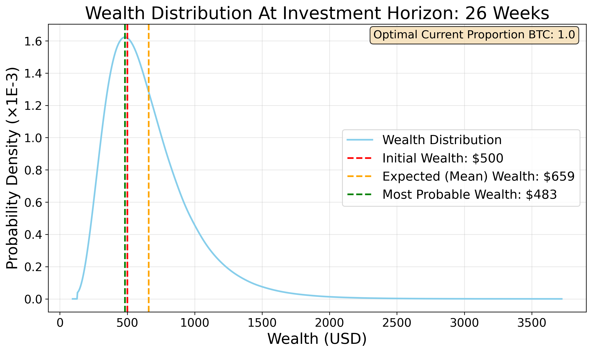
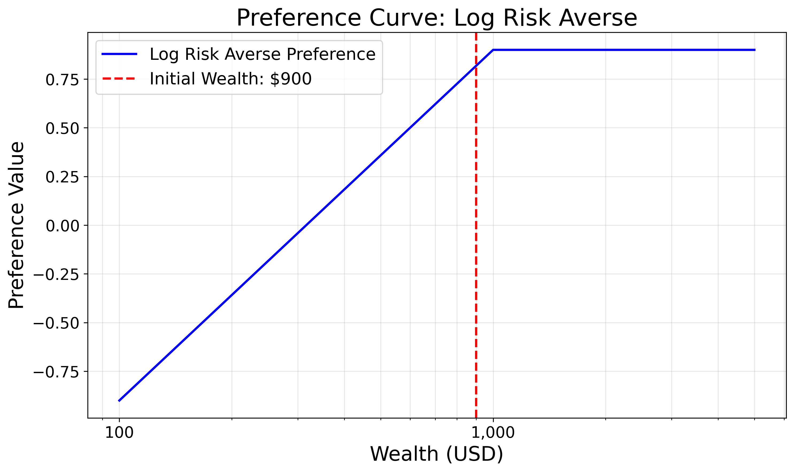
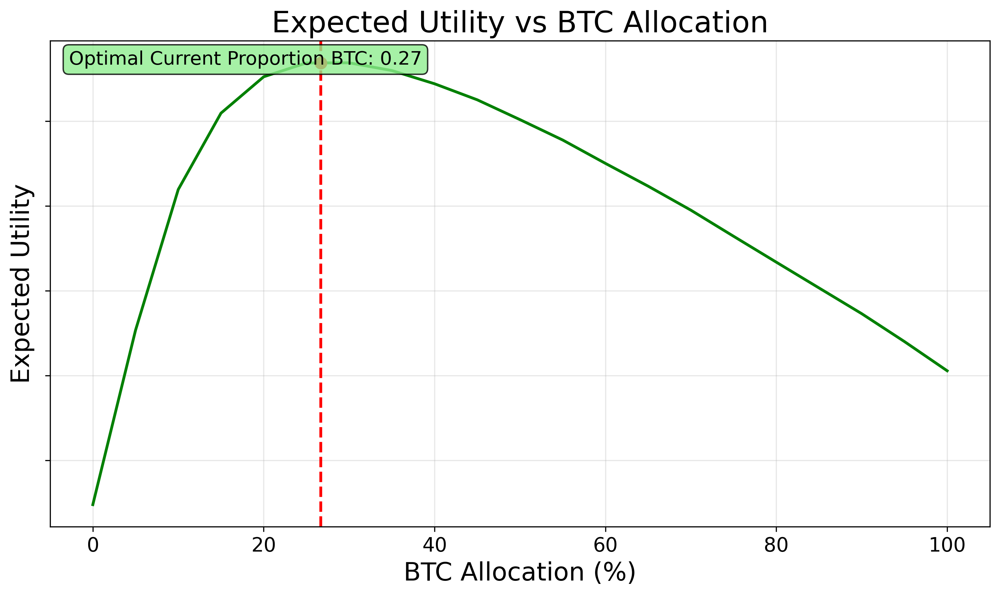
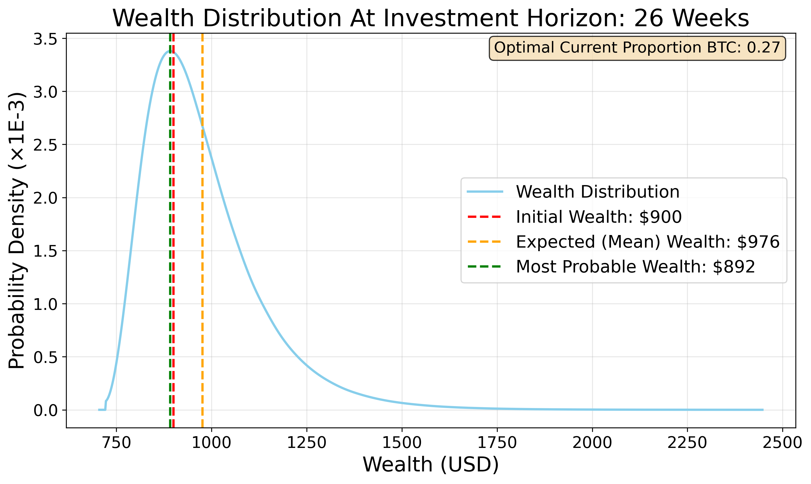
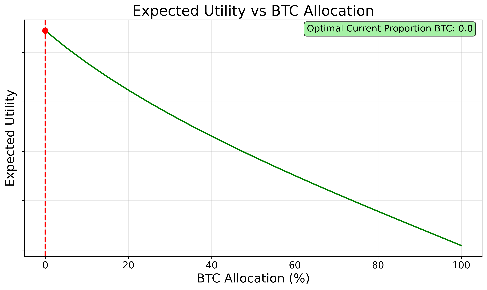
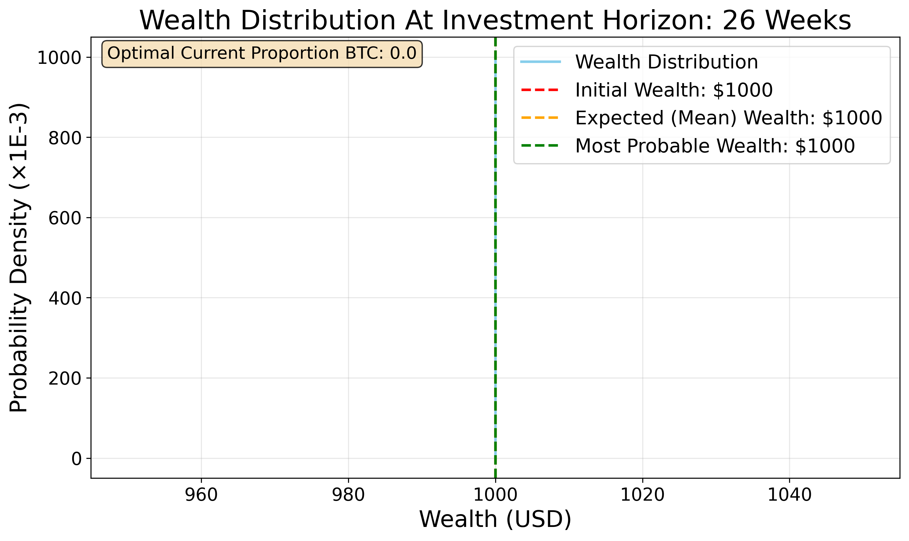

# quant-gp

This project aims to optimise the proportion of Bitcoin (BTC) vs cash in a portfolio. It uses a probabilistic approach to not just maximise expected returns but also manage risk, as defined by the user's subjective preferences.

The key components of the project include:

## **Data Formatting**: 

The `a_data/format_data.py` script processes historical BTC price data, ensuring it's clean and ready for analysis.

## **Logarithmic fit**: 
The `b_log_fit/log_fit.py` script fits a logarithmic curve to the historical BTC price data, which describes the long-term trend of BTC prices.

## **Gaussian Process Regression**: 
The `c_gp_fit/gp_fit.py` script fits a Gaussian Process Regression to model the log BTC prices.

This is a probabilistic model that conditions a joint Gaussian distribution on the observed data to make predictions about future prices. These predictions include both a mean (expected price) and a standard deviation (uncertainty about that price).

To capture the price behaviour, it uses a custom kernel that combines:
- A periodic kernel (to capture the ~4 year cyclical nature of BTC prices)
- A radial basis function (RBF) kernel (to capture smooth short term trends)
- A white noise kernel (to account for day-to-day price volatility)

## **Portfolio Optimisation**:
The `d_optimise_portfolio/optimise_portfolio.py` script optimises the BTC vs cash allocation in the portfolio vector for a sequence of steps in the future, $\mathbf{p}$, based on the following objective:

$$
\arg\max_{\mathbf{p}}\ \mathbb{E}\big[U(\log W_T(\mathbf{p}))\big]
\;=\;
\arg\max_{\mathbf{p}}\ 
\int_{\mathbb{R}^T}
U\!\Bigg(\log W_0 + \sum_{t=0}^{N-1} \log\!\big( (1-p_t) + p_t\,e^{\,x_{t+1}-x_t}\big)\Bigg)
\; p(x_{1:T}) \; dx_1\cdots dx_T
$$

Where:
- $E[\cdot]$: expectation under the forecast distribution for future log-prices.
- $U(\cdot)$: utility function applied to log-wealth.
- $W_T(\mathbf{p})$: terminal (final) portfolio wealth at the optimisation horizon $T$ given portfolio allocation $\mathbf{p}$.
- $W_0$: initial wealth (cfg.initial_wealth in code).
- $p_t$: fraction of portfolio allocated to BTC at rebalance $t$ ($0 \leq p_t \leq 1$).
- $x_t$: log-price at rebalance time $t$; $x_{t+1} - x_t$ is the log-return from $t$ to $t+1$.
- $N$ (or $T$): number of rebalancing periods (horizon length).
- $p(x_{1:T})$: joint predictive density of future log-prices.

N.B. The log wealth is used to make the objective function additive, instead of multiplicative, which allows for numerically stable accumulation of per-period returns (summing log‑factors), simpler vectorised evaluation across many simulated paths, and more stable integration and optimisation.

## **Example Outputs**:

Let's explore some example outputs from the optimisation process to understand how it may work in practice. For these examples, only 1 rebalance step is considered (i.e., the portfolio is adjusted once at the start of the investment horizon).

The Gaussian Process model predicts the following distribution for the BTC price over the near future (Figure 1):

_Figure 1: Predicted BTC Price Distribution_

Jimmy is saving up to buy a new laptop for university in 6 months time, for $1000. He has no need for anything else. He has some money to invest and the better the returns, the less time he has to spend at is part-time job to afford the laptop.

Therefore his subjective preference curve increases as wealth approaches $1000, but flattens out after that point as he has no further need for more money, as shown in Figure 2.

### Case 1 Initial Wealth = $500:

With an initial wealth of $500, Jimmy is far from his goal of $1000.

_Figure 2: Preference Curve for Case 1_

Since the general market trend is upwards, the utility is maximised by going all-in on BTC (100% allocation), as shown in Figure 3.

_Figure 3: Expected Utility vs BTC Allocation for Case 1_

The expected wealth distribution of this strategy after 6 months is shown in Figure 4.

_Figure 4: Expected Final Wealth Distribution for Case 1_

### Case 2 Initial Wealth = $900:

With an initial wealth of $900, Jimmy is much closer to his goal of $1000, as shown in Figure 5. It is likely he will reach this goal even with a conservative investment strategy, but investing too much risks a large loss if the market takes a downturn, leading him to need to work much harder at his part-time job to make up the shortfall.

_Figure 5: Preference Curve for Case 2_

In this case, the optimal strategy is to allocate only 27% of the portfolio to BTC, to get some exposure to the upside, but limit the downside risk, as shown in Figure 6.

_Figure 6: Expected Utility vs BTC Allocation for Case 2_

The expected wealth distribution of this strategy after 6 months is shown in Figure 7.

_Figure 7: Expected Final Wealth Distribution for Case 2_

### Case 3 Initial Wealth = $1000:

With an initial wealth of $1000, Jimmy has already reached his goal, as shown in Figure 8. Since the marginal utility of additional wealth is zero, he has nothing to gain from investing in the risky asset that could fall in value.

_Figure 8: Preference Curve for Case 3_

Therefore the optimal strategy is to allocate 0% of the portfolio to BTC, as shown in Figure 9.

_Figure 9: Expected Utility vs BTC Allocation for Case 3_

The expected wealth distribution of this strategy after 6 months is shown in Figure 10. Note that it has no variance, since the portfolio is held entirely in cash.

