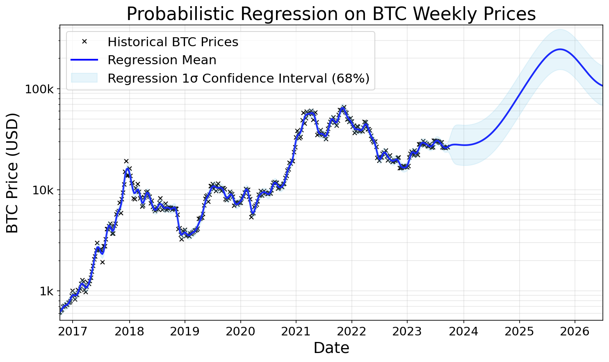
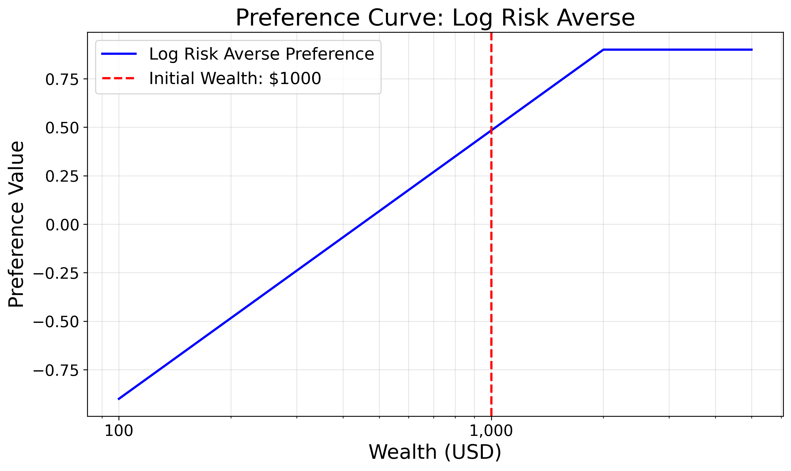
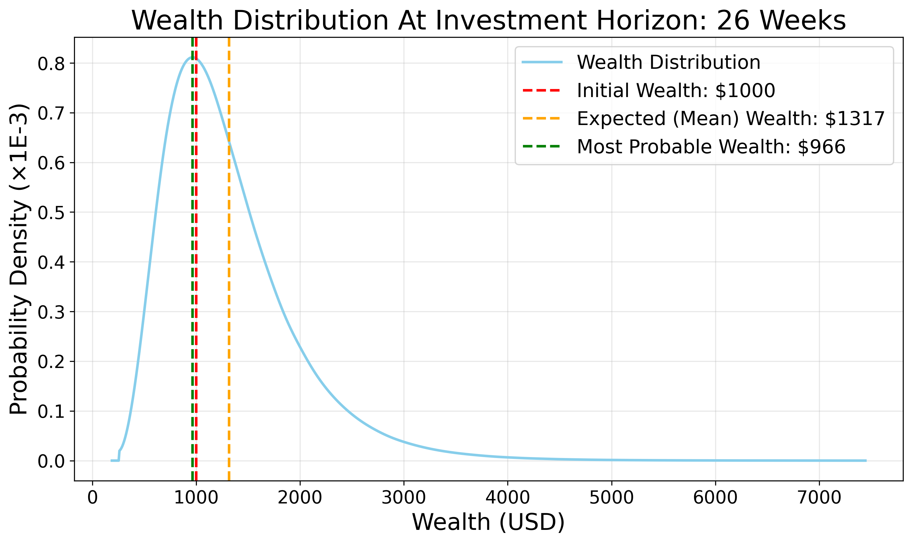
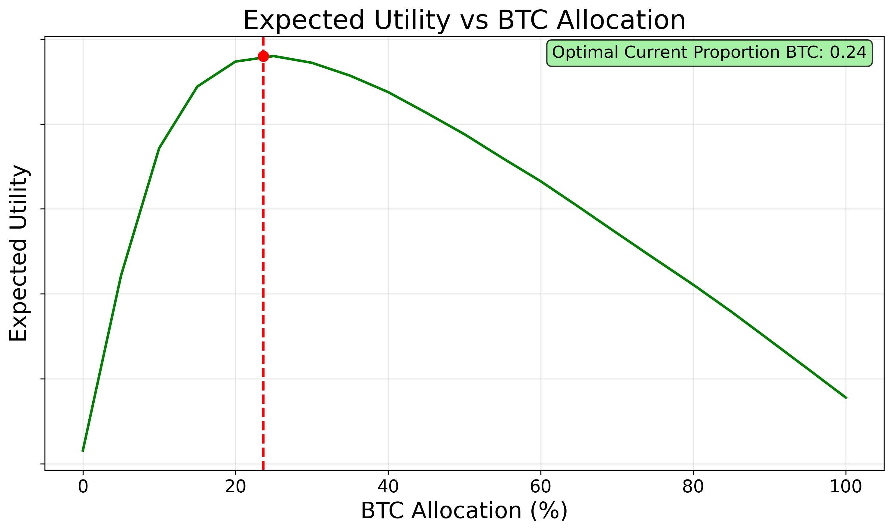
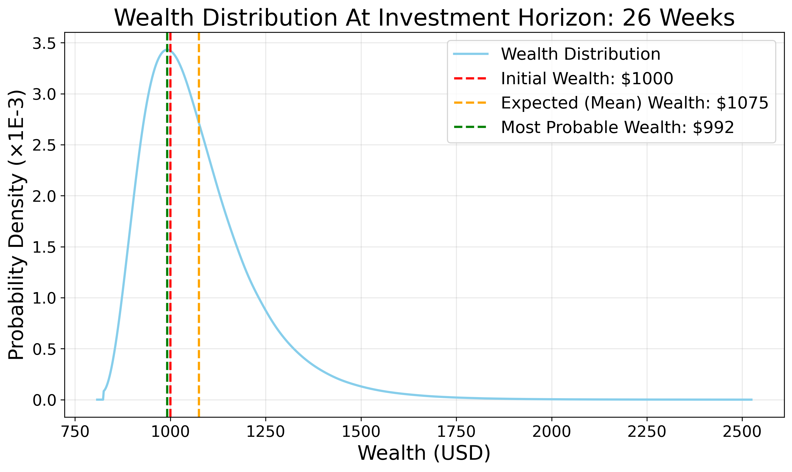
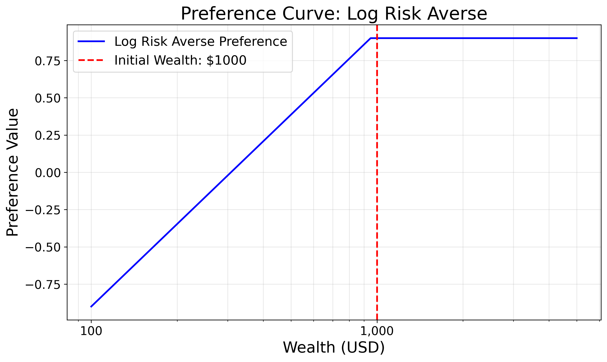
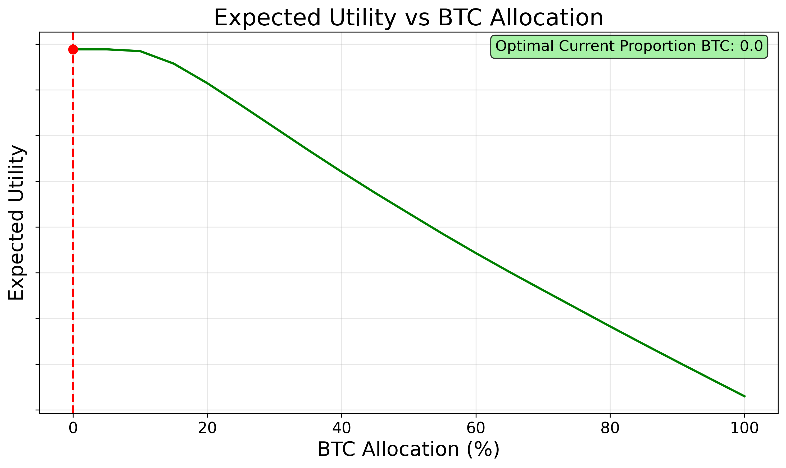
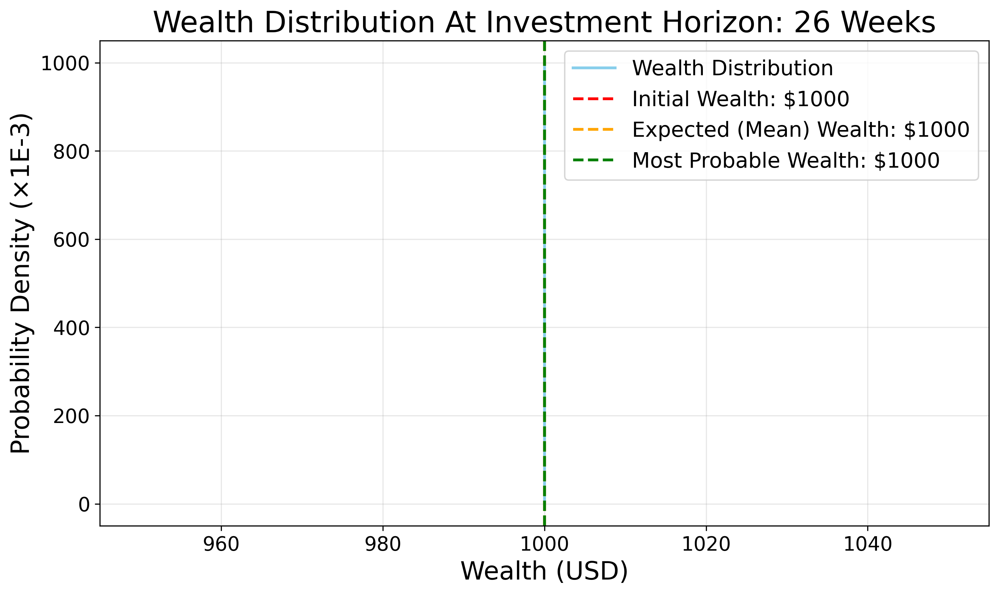

# **quant-gp**

## **Overview:**

This project aims to optimise the proportion of Bitcoin (BTC) vs cash in a portfolio. It uses a probabilistic approach to not just maximise expected returns but also manage risk, as defined by the user's subjective preferences.

The main ML packages used are:
- `scikit-learn`: for the primary Gaussian Process Regression model.
- `scikit-optimize`: for portfolio optimisation algorithms such as Bayesian optimisation and random forest methods.
- `scipy`: for numerical integration and optimisation of the portfolio allocation.
- `pandas` and `numpy`: for data manipulation and numerical operations.
- `matplotlib`: for visualisation of results.


## **Setup:**
Download the two CSVs and place them in a_data, create and activate the virtual environment, install dependencies, then run the pipeline.


1. Create and activate the virtual environment, install dependencies
   ```bash
   # from repo root
   python3 -m venv venv
   source venv/bin/activate

   # install requirements (ensure requirements.txt exists)
   pip install -r requirements.txt
   ```


2. Download the required datasets as described in the "Data Sources / Acknowledgement" section below, and place them in the `a_data/` directory.


3. Configure the portfolio optimisation with `d_optimise_portfolio/config.py`, including settings related to:
    - Initial wealth
    - Preference curve (custom curves can be written if needed)
    - Investment horizon and rebalance frequency
    - Optimisation methods


4. Run the pipeline
   ```bash
   # from repo root
   python main.py
   ```

## **Pipeline Overview:**
The key components of the project include:

### Data Formatting: 

The `a_data/format_data.py` script processes historical BTC price data, ensuring it's clean and ready for analysis.

### Logarithmic fit:
The `b_log_fit/log_fit.py` script fits a logarithmic curve to the historical BTC price data, which describes the long-term trend of BTC prices.

### Gaussian Process Regression:
The `c_gp_fit/gp_fit.py` script fits a Gaussian Process Regression model to the log BTC prices.

More specifically, it models the residuals of the log price after removing the long-term trend identified in the previous step, to allow for a zero-mean prior.

This is a probabilistic model that conditions a joint Gaussian distribution on the observed data to make predictions about future prices. These predictions include both a mean (expected price) and a standard deviation (uncertainty about that price).

To capture the price behaviour, it uses a custom kernel that combines:
- A periodic kernel (to capture the ~4 year cyclical nature of BTC prices)
- A radial basis function (RBF) kernel (to capture smooth short term trends)
- A white noise kernel (to account for day-to-day price volatility)

### Portfolio Optimisation:
The `d_optimise_portfolio/optimise_portfolio.py` script uses the future price predictions of the Gaussian Process model to optimises the best BTC vs cash allocation in the portfolio for each of a sequence of rebalancing steps, $\mathbf{p}$, based on the following objective:

$$
\mathbb{E}\big[U(\log W_T)\big]
\;=\; 
\int_{\mathbb{R}^T}
U \Bigg(\log W_0 + \sum_{t=0}^{T-1} \log \big( (1-p_t) + p_t\,e^{\,x_{t+1}-x_t}\big)\Bigg)
\; p(x_{1:T}) \; dx_1\cdots dx_T
$$


Where:
- $E[\cdot]$: expectation under the forecast distribution for future log-prices.
- $U(\cdot)$: utility function applied to log-wealth.
- $W_T(\mathbf{p})$: terminal (final) portfolio wealth at the optimisation horizon $T$ given portfolio allocation $\mathbf{p}$.
- $W_0$: initial wealth (cfg.initial_wealth in code).
- $p_t$: fraction of portfolio allocated to BTC at rebalance $t$ ($0 \leq p_t \leq 1$).
- $x_t$: log-price at rebalance time $t$; $x_{t+1} - x_t$ is the log-return from $t$ to $t+1$.
- $T$: number of rebalancing periods (horizon length).
- $p(x_{1:T})$: joint predictive density of future log-prices.

N.B. The log wealth is used to make the objective function additive, instead of multiplicative, which allows for numerically stable accumulation of per-period returns (summing log‑factors), simpler vectorised evaluation across many simulated paths, and more stable integration and optimisation.

In practice, the only first rebalancing step would be used to set each portfolio allocation, with the model being refit with up-to-date data for the next rebalance step.

## **Example Outputs**:

Let's explore some example outputs from the optimisation process to understand how it may work in practice. For these examples, only 1 rebalance step is considered (i.e., the portfolio is adjusted once at the start of the 26 week investment horizon, and not rebalanced along the way).

The Gaussian Process model predicts the following distribution for the BTC price over the near future (Figure 1):



_Figure 1: Predicted BTC Price Distribution_

Meet Jimmy, who is saving up to buy a new laptop for university in 26 weeks time. We will consider 3 different scenarios of different laptop prices. He has an initial wealth of $1000 (£746), and wants to reach a target wealth equal to the laptop price. Once he reaches this target, we will assume he has no further need for more money. The further he falls short of this target, the more he will need to work at his part-time job to make up the shortfall.

Therefore his subjective preference curve increases as wealth approaches the price of the laptop, but flattens out after that point as he has no further need for more money, as shown in Figure 2.


### Case 1 Laptop Price: $2000:

With a laptop price of $2000, Jimmy is far from his goal with an initial wealth of $1000, as shown in Figure 2. This means he will need to work many hours at his part-time job unless he can make a significant return on his investment.



_Figure 2: Preference Curve for Case 1_

Since the market is generally predicted to rise, its more likely than not that he will make a positive return on whatever he invests. So, the utility is maximised by going all-in on BTC (100% allocation), as shown in Figure 3.


_Figure 3: Expected Utility vs BTC Allocation for Case 1_

The expected wealth distribution of this strategy after 26 weeks is shown in Figure 4.



_Figure 4: Expected Final Wealth Distribution for Case 1_

### Case 2 Laptop Price = $1100:

Here, the price of the laptop is much closer to Jimmy's current starting wealth of $1000, as shown in Figure 5. It is likely he will reach this goal even with a conservative investment strategy, but investing too much would risk a large loss if the market takes a downturn, which would mean him working much longer hours at his part-time job to make up the shortfall.


_Figure 5: Preference Curve for Case 2_

In this case, there is no need to take on excessive risk, so the optimal strategy is to allocate only 24% of the portfolio to BTC, to get some exposure to the upside, but limit the downside risk, as shown in Figure 6.


_Figure 6: Expected Utility vs BTC Allocation for Case 2_

The expected wealth distribution of this strategy after 26 weeks is shown in Figure 7.


_Figure 7: Expected Final Wealth Distribution for Case 2_

Note that the expected (mean) wealth is lower than in Case 1, since the portfolio is less risky, but the chance of falling short of the laptop price is also much lower.

### Case 3 Laptop Price = $950

With an initial wealth of $1000, Jimmy has already reached his goal, as shown in Figure 8. Since the marginal utility of additional wealth is zero, he has nothing to gain from investing in the risky asset that has a chance of falling in value, even though the asset is more likely to rise.



_Figure 8: Preference Curve for Case 3_

Therefore the optimal strategy is to allocate 0% of the portfolio to BTC, as shown in Figure 9.


_Figure 9: Expected Utility vs BTC Allocation for Case 3_

The expected wealth distribution of this strategy after 26 weeks is shown in Figure 10. Note that it has no chance of increasing or decreasing since the portfolio is held entirely in cash.



_Figure 10: Expected Final Wealth Distribution for Case 3_

### Discussion:
The optimal allocation for all three cases is different, despite the same market predictions and starting capital, because this depends on the subjective preferences and goals of the investor.

This highlights the importance of considering individual risk tolerance and investment goals when making portfolio decisions, which can be mathematically defined in a preference curve using this model.

Overall, the actual price predictions from the Gaussian Process model are dubious at best, and unlikely to be validated by forward testing. However, the main purpose of this project is to demonstrate the portfolio optimisation framework, which is a sound way to optimise a portfolio given an accurate probabilistic forecast of future asset prices using a well-defined utility function.

## Data Sources / Acknowledgement

- BTC 1-minute data: "bitcoin-historical-data" by mczielinski, Kaggle. Download and save as `a_data/btcusd_1-min_data.csv`.
  https://www.kaggle.com/datasets/mczielinski/bitcoin-historical-data

- Historical BTC data: "bitcoin-historical-data" by shiivvvaam, Kaggle. Download and save as `a_data/BitcoinHistory.csv`.
  https://www.kaggle.com/datasets/shiivvvaam/bitcoin-historical-data

Please check each Kaggle dataset page for licensing and attribution requirements. These files are not included in this repository; follow the instructions below to download them.

## Disclaimer

This repository is a conceptual demonstration for educational purposes only. It is not intended to produce reliable predictions.

It is not financial advice and should not be relied upon for investment decisions. The author is not a financial advisor.